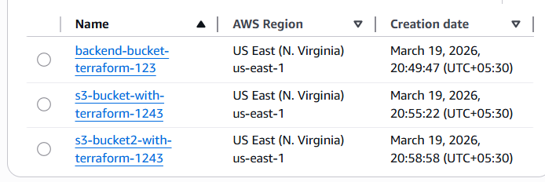

day 4 - Terraform state file management with aws s3

hand-on with tech-tutorials with piyush

#### Successfully configured the backend "s3"! Terraform will automatically use this backend unless the backend configuration changes.
Initializing provider plugins...
- Finding hashicorp/aws versions matching "~> 6.0"...
- Installing hashicorp/aws v6.37.0...
- Installed hashicorp/aws v6.37.0 (signed by HashiCorp)
Terraform has created a lock file .terraform.lock.hcl to record the provider
selections it made above. Include this file in your version control repository   
so that Terraform can guarantee to make the same selections by default when      
you run "terraform init" in the future.

$ terraform graph
digraph G {
  rankdir = "RL";
  node [shape = rect, fontname = "sans-serif"];
  "aws_s3_bucket.example" [label="aws_s3_bucket.example"];
  "aws_s3_bucket.example2" [label="aws_s3_bucket.example2"];
}

#Successfully done!!!
##backend (statefile) in aws-s3 remote

